# TRAFFIC : A data-driven foundation for reparative justice
*A transparent “golden source” tracing the economic architecture of enslavement.*

---

## Elevator Pitch

This initiative constructs the first unified data model and ingestion platform for historical material related to transatlantic slavery. It consolidates shipping logs, estate ledgers, tax records, compensation data, and archival documents into an open, auditable “golden source.” Using modern AI and distributed contribution tools, the system builds a complete forensic chain of financial flows from capture to compensation. The result is a transparent foundation for researchers, policymakers, and descendant communities to examine slavery’s economic legacy with unprecedented clarity.

---

## Scope

This project focuses on documenting the slave trade and the economic and fiscal flows associated with it, together with the outputs of those held as slaves on plantations, in factories, and in households.

Slavery is a problem our societies still confront today.  
The scope of this project is **historical slavery**, understood as the legally sanctioned systems that created, taxed, regulated, and later officially abolished slavery—though often only in part.

The table and timelines below set out how slavery became acceptable, taxable, regulated, and eventually abolished.  
The **United States** still has the power to sentence a person convicted of a crime to slavery.

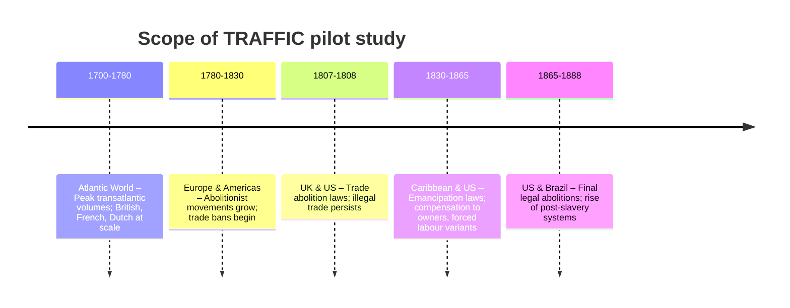

---

## Definition: TRAFFIC

For the purposes of this project, **TRAFFIC** refers to the organised movement, sale, transfer, or forced relocation of human beings for exploitation or financial gain.

The term includes:

- Capture or coercion of individuals  
- Forced transport by land or sea  
- Sale or transfer of people as property  
- Movement between plantations, estates, ships, or markets  
- Inter-colonial or intra-national relocation for labour  
- Ownership transfers through sale, inheritance, mortgage, or corporate control  
- State-sanctioned relocation (penal labour, military impressment, judicial orders)  
- Post-abolition systems that continued forced labour under new legal terms  

This definition aligns with international standards (UN Palermo Protocol, ILO, OHCHR) and with the historical legal frameworks of the UK, Europe, the United States, and Brazil.  
It is intentionally broad to allow accurate reconstruction of financial flows, ownership networks, and institutional responsibility across the entire transatlantic slavery system.  

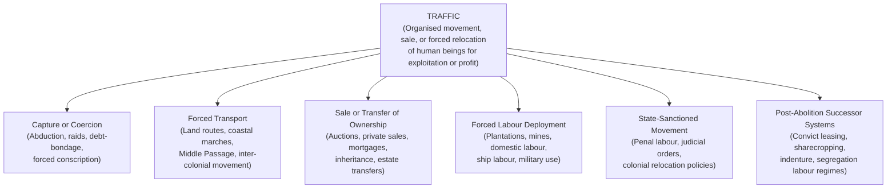

---

## Regional Phases of the Transatlantic Slave System

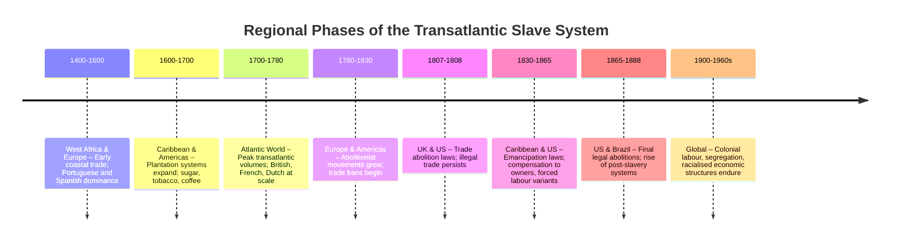

---

## Slavery Timeline Overview

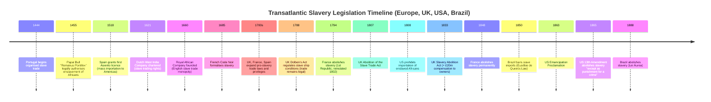

---

## Comparative Legislation Table (UK, Europe, USA, Brazil)

| Country        | Legalisation / Expansion                          | Regulation / Encouragement                          | Abolition of Trade                     | Abolition of Slavery                         |
|----------------|----------------------------------------------------|------------------------------------------------------|-----------------------------------------|-----------------------------------------------|
| **Portugal**   | 1444: First African slave shipments; 1455: Papal Bull | Crown licences expand Brazil-African trade          | Gradual, under pressure from Britain     | 1869 (formal end), still active in colonies until late 1800s |
| **Spain**      | 1518: Asiento licence for African imports          | Outsourced Asientos to other European traders       | Early 1800s, final suppression 1820s     | 1886 (Cuba), 1873 (Puerto Rico)              |
| **France**     | 1685: Code Noir legalises slavery in colonies      | 1716–1760s: Trade expansion laws                    | 1815 (Napoleon’s fall); 1826 enforcement| 1848 (Second Republic)                        |
| **Netherlands**| 1621: Dutch West India Co. chartered               | Vast expansion in Suriname & Caribbean              | 1814 (trade banned)                      | 1863 (Slavery ended; forced labour until 1873)|
| **United Kingdom** | 1660: Royal African Company monopoly          | 1698: Trade opened; 1700s Navigation Acts encourage | 1807: Abolition of Slave Trade Act       | 1833: Slavery Abolition Act (compensation to owners) |
| **United States** | 1660s–1700s: Colonial slave codes                | Constitution protects trade until 1808; 1850 Fugitive Slave Act | 1808: Importation banned         | 1865: 13th Amendment                           |
| **Brazil**     | Mid-1500s: Crown sanctions large-scale imports     | 1700s–1800s expansion tied to sugar & coffee        | 1850: Eusébio de Queirós Law            | 1888: Lei Áurea (last in Western hemisphere)  |

---

## Slavery Timeline by Country

### United Kingdom

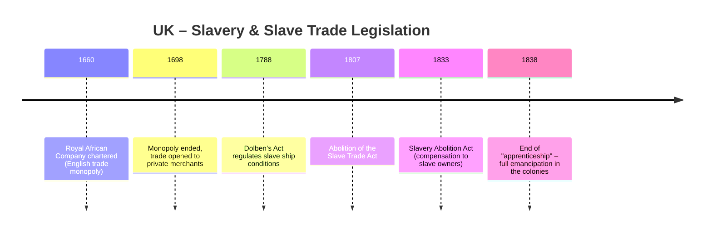

### United States

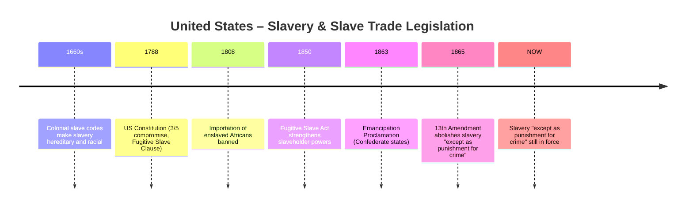

### Brazil

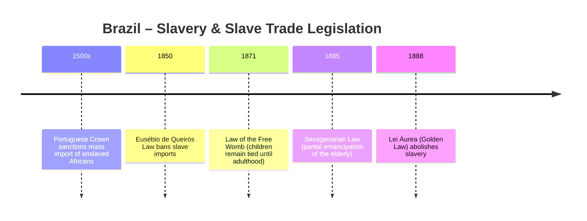

---

## Compensation, Manumission & Post-Abolition Systems

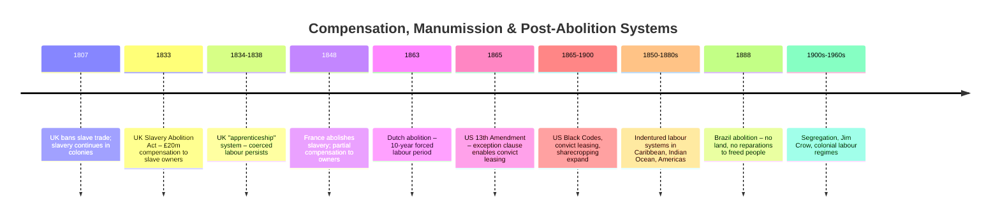

---

## Target Consumers

This project is designed first and foremost for:

- **Descendants of enslaved people** – seeking accurate, evidence-based family, community, and lineage histories.
- **Potential plaintiffs** – preparing for legal or civic actions relating to reparations, accountability, or historical responsibility.

Secondary beneficiaries include:

- **Governments (national and local)** – developing or preparing for policy, commissions, or legislation relating to reparations, historical justice, or institutional accountability.
- **Historians and archivists** – requiring integrated, cross-archive documentation.
- **Economists, legal scholars, and policymakers** – supporting transparent and defensible reparations modelling.
- **Journalists and documentary teams** – investigating historical and institutional links.
- **Educational institutions** – teaching the economic, social, and political history of enslavement.
- **Public bodies and NGOs** – working on truth, justice, and reconciliation.
- **Institutions with historical ties** (banks, insurers, churches, estates) – pursuing transparency, auditing, and acknowledgment.

---

## Target Ecosystem

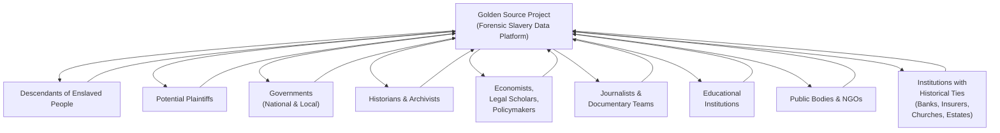

---

## System Overview

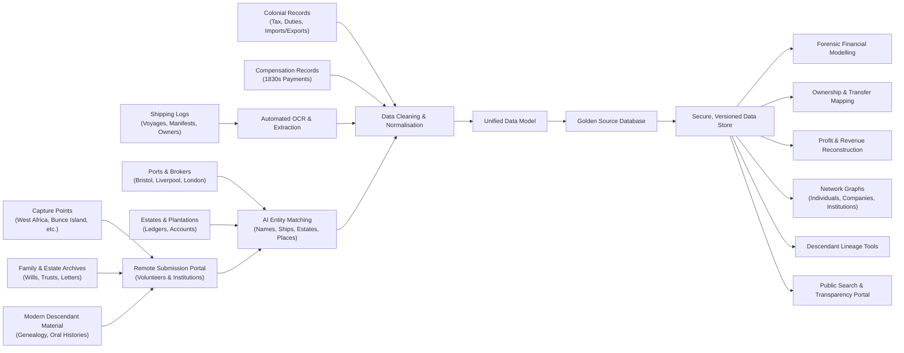

---

## Data Flow Overview

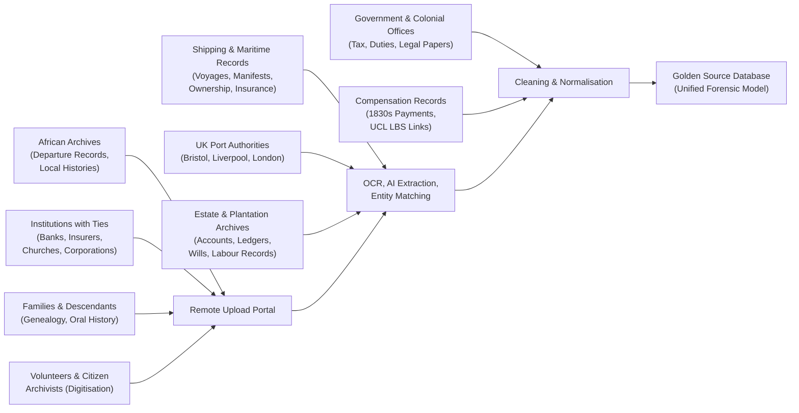

---

## Governance & Advisory Structure

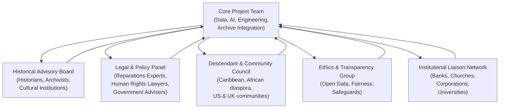

---

## Funding & Funding Rounds

This project is structured as a public-benefit initiative requiring broad and internationally trusted support. Funding will be sought from:

### Global Institutions
- **United Nations bodies** (UNESCO, UNDP, OHCHR, UNFPA)
- **African Union (AU)** and **CARICOM Reparations Commission**
- **Major international NGOs** (Amnesty International, Human Rights Watch, IJM)

### Philanthropic Foundations
- Mellon Foundation  
- Ford Foundation  
- Open Society Foundations  
- Nuffield, Leverhulme, Wellcome  
- Skoll, Rockefeller, and similar global philanthropies

### Academic & Research Funds
- EU Horizon  
- UKRI (ESRC, AHRC)  
- Swiss National Science Foundation  
- University consortiums and research centres

### Government Support
- National and local governments preparing policy or legislation
- Truth and reconciliation commissions
- Cultural ministries and justice departments

### Ethical Corporate Contributors
- Institutions with historical ties (banks, insurers, churches, universities)
- Organisations seeking transparency, auditing, or accountability

### Public Donations & Crowdfunding
- To maintain independence and long-term sustainability

---

## Proposed Funding Stages

**Pre-Seed (£50k–£150k)**  
- Data model, infrastructure, initial ingestion

**Seed (£250k–£750k)**  
- Pilot archives, volunteer portal, advisory structure

**Series A (£1m–£3m)**  
- Public portal, forensic modelling, descendant tools

**Series B (£3m–£10m)**  
- Global expansion, multilingual interfaces, sustainability

---

## Funding Roadmap

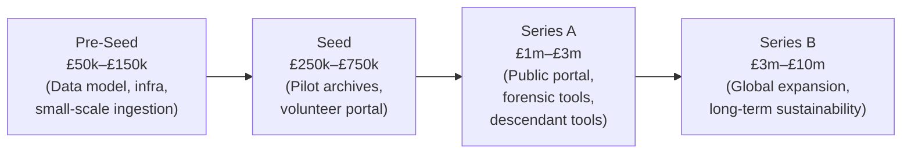

---

## Competitive Landscape

At present, **no** project provides a single, unified, public “source of truth” that reconstructs the complete financial architecture of slavery—from capture points through transport, ownership, labour, profit, taxation, and compensation.

Existing efforts are valuable but **fragmented**:

- **Slave Voyages Database** – Maritime-only; no financial trail.
- **UCL – Legacies of British Slave-ownership** – Strong ownership & compensation data; limited integration.
- **National Archives (Kew)** – Holds vast records; no unified schema or transparency.
- **Institutional acknowledgements** – Banks, insurers, churches; no forensic audits.
- **Academic research** – Rich but siloed; no integrated financial modelling.

**No existing initiative builds a financial chain of evidence across regions, institutions, and centuries.**

---

## Why This Project Is Different

### 1. A complete forensic trail  
End-to-end reconstruction of financial flows—from capture to compensation.

### 2. A transparent, public “golden source”  
Open, permanent, and designed for public scrutiny and contribution.

### 3. Modern ingestion capabilities  
Software already in place for remote submission by volunteers and record-keepers.

### 4. Data modelling suited to reparations  
A schema capable of supporting defensible quantum calculations.

### 5. Support for descendants  
A platform enabling accurate, evidence-based family and community history.

### 6. Integration across archives  
A system designed to link digital archives, national repositories, academic datasets, and contributed material.
